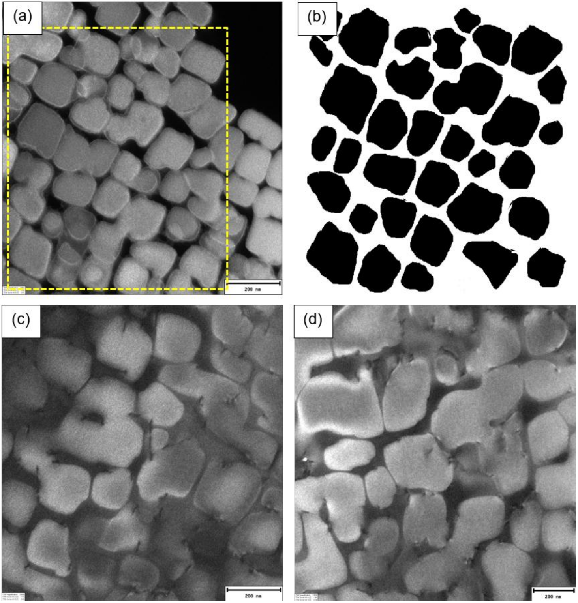
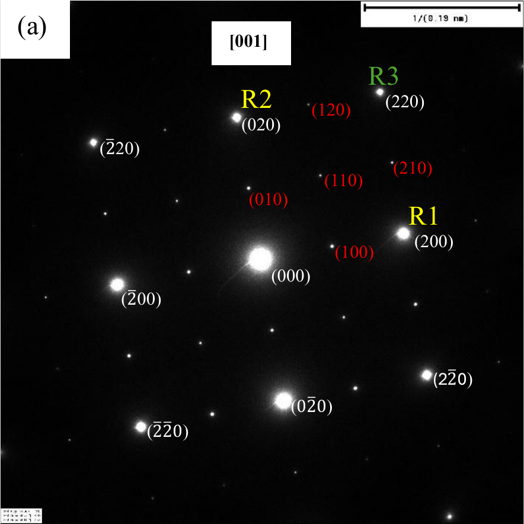
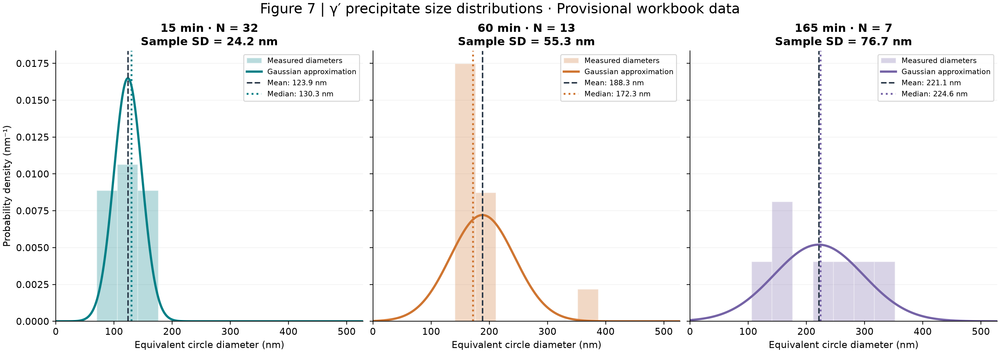
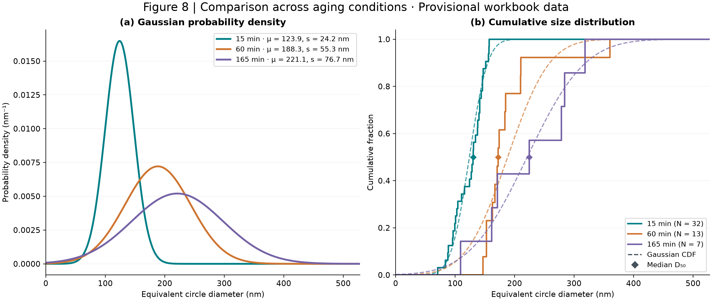

# CMSX-4 · γ′ Precipitate Size Distribution

**Python analysis of gamma-prime precipitates in a gamma matrix, for a nickel-based single-crystal superalloy used in aerospace applications.**

From measured particle areas to equivalent diameters, probability densities, and cumulative size distributions. This repository compares **15, 60, and 165 minutes of aging** and generates the plot layouts used for Figures 7 and 8 of the associated laboratory report.

> **Dataset status:** the final dataset will be added by the author. The included measurements and plots are provisional, taken from the supplied `PrecipitationResults_Summary.xlsx`. They do **not** reproduce the report's final results for the 60 and 165 min conditions. See [data provenance](data/README.md).

## Microstructure at a glance

<p align="center">
  
</p>

**Dark-field TEM of CMSX-4 (ERBO/1-C).** Report Figure 1: (a) 15 min, (b) binary segmentation mask, (c) 60 min, and (d) 165 min. The micrograph scale bars represent **200 nm**. The images provide experimental context; the Python workflow starts from measured particle diameters and does not perform image segmentation.

<details>
<summary><strong>Selected-area electron diffraction · cubic ⟨100⟩ family</strong></summary>

<p align="center">
  
</p>

**Figure 2 after 15 min aging.** The report labels this zone axis **[001]**. It belongs to the same cubic ⟨100⟩ family as [100]; the original indexing is preserved. Fundamental and superlattice reflections provide context for the γ/γ′ microstructure.

</details>

## A brief experimental context

The broader experiment investigated precipitation in **CMSX-4 (ERBO/1-C)** using heat treatment, Vickers hardness, transmission electron microscopy, and X-ray diffraction. This repository focuses on the measured size distribution of ordered γ′ precipitates within the γ matrix. The full hardness, lattice-misfit, and antiphase-boundary-energy analyses remain outside its scope.

**Temperature metadata needs verification:** the report's procedure states 1055 °C, while its TEM figure captions and the supplied workbook state 1050 °C. Plots therefore identify aging time without assigning a single unverified temperature.

## Figure 3 · Probability density distributions



Normalized histograms show the measured equivalent diameters for each aging condition. Each panel includes a descriptive Gaussian curve, the arithmetic mean, the median, the sample standard deviation, and the particle count. All panels use common bin edges and shared axes.

## Figure 4 · Gaussian comparison and cumulative size distribution



**(a)** Gaussian probability density curves for all three aging conditions. **(b)** Empirical cumulative distributions (solid steps), Gaussian CDFs (dashed), and median D₅₀ markers (diamonds).

## Run the analysis

Use Python 3.10 or newer. From the repository folder:

```bash
python -m venv .venv
source .venv/bin/activate
# Windows PowerShell: .venv\Scripts\Activate.ps1
python -m pip install -r requirements.txt

python ppt_size_distribution.py \
  --input data/provisional_diameters.csv \
  --output figures \
  --label "Provisional workbook data"
```

The script writes **PNG and SVG** versions of both figures plus `summary_statistics.csv`. It runs without a notebook or a graphical display. Use `--bins 10` to explore histogram bin sensitivity; the default is 15.

### Add your final measurements

Copy `data/diameters_template.csv` to `data/final_diameters.csv`. Keep the header and add **one particle per row**:

```csv
aging_time_min,diameter_nm
```

Use aging times `15`, `60`, and `165`, with positive equivalent diameters in **nm**. Include at least two distinct diameters per condition. Duplicate diameter values are valid measurements and are retained. Blank, nonnumeric, infinite, and nonpositive measurements are rejected rather than silently removed.

```bash
python ppt_size_distribution.py \
  --input data/final_diameters.csv \
  --output figures \
  --label "Final measurements"
```

The local final-data filename is ignored by Git until you deliberately add it with `git add -f data/final_diameters.csv`. After checking the results, update the dataset-status note and provenance record when publishing the final dataset.

The original workbook layout is also supported:

```bash
python ppt_size_distribution.py \
  --input /path/to/PrecipitationResults_Summary.xlsx \
  --output figures \
  --label "Provisional workbook data"
```

This reads the `D_eq (nm)` column from `15_min_0p25_h`, `60_min_1_h`, and `165_min_2p75_h`, with headers on Excel row 2. All statistics are recalculated from the particle rows.

## Method

For a measured projected particle area A, the equivalent circle diameter is:

$$D_{eq}=2\sqrt{\frac{A}{\pi}}$$

The supplied diameters are already in nanometres. For each condition, the script calculates the arithmetic mean, median, and **sample standard deviation** (`ddof=1`). It uses the mean and sample SD to parameterize a normal density, following the descriptive comparison in the original workflow. This is not a least-squares histogram fit or a maximum-likelihood estimate of the Gaussian standard deviation.

The empirical CDF is the fraction of measured particles with diameter ≤ D. The Gaussian is a descriptive approximation: it is not evidence of normality, and its mathematical support includes negative diameters even though the plots display only D ≥ 0. No tail renormalization or outlier removal is applied. The median marker uses the interpolated sample median, so for an even sample it may fall between ECDF jumps.

These are distributions of **2D equivalent circle diameters**. No 3D stereological correction is applied. Small particle counts, image selection, segmentation, foil geometry, and histogram binning affect interpretation. Increasing mean size alone does not establish a particular coarsening law.

## Repository contents

```text
ppt_size_distribution.py       Standalone analysis and plotting command
requirements.txt               Python dependencies
data/                          Provisional measurements, blank template, provenance
assets/                        TEM and SAED extracts with source attribution
figures/                       Generated Figure 7, Figure 8, and statistics
tests/                         Numerical and input-validation tests
```

Run the checks with `python -m unittest discover -s tests -v`.

## Credits and source material

Based on the Python workflow supplied by **Anmol Chahal** and the laboratory report by **Anmol Chahal and Amir Yekta**, *Investigations through transmission electron microscopy & X-Ray diffraction*, Lab Course: Precipitation, FAU Department of Materials Science and Engineering, winter semester 2025/2026, third submission. The report attributes the TEM and hardness sections to Anmol Chahal and the XRD, APBE, introduction, and final assembly to Amir Yekta.

The TEM and SAED assets are extracts from report Figures 6 and 5(a), respectively. The full report is not bundled. See [asset provenance](assets/README.md) for exact source locations. No blanket reuse license is assigned to the code, data, or images in this repository; permission remains with the respective rights holders.
